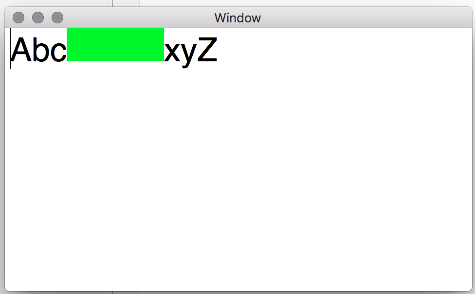
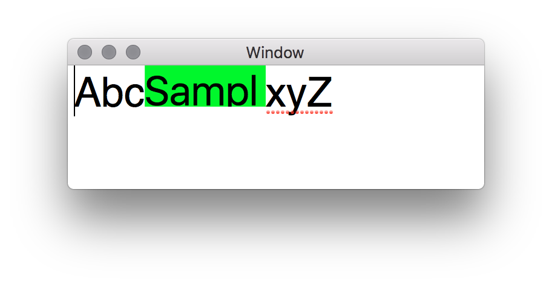
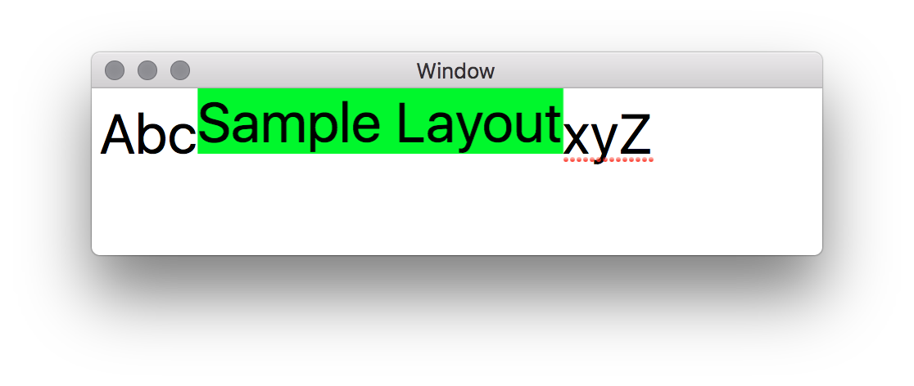
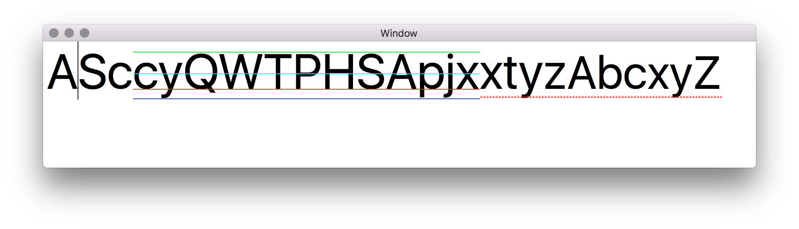

# Cocoa Text Attachment Cells

This project works through an example Cocoa project which creates ***NSTextAttachment*** cells which can be embedded within *attributed text views*. Whilst aimed at *OS X* Cocoa based applications the techniques presented here are equally applicable (in most places) to *iOS* apps.

## Creating Basic Attachments

Before we can get into producing any interesting code we need to setup the basic framework for displaying attributed text and showing a simple *cell*.   

For the purposes of this post we're going to create images to represent cell content, so the first step we need to do is create a test image for our cell. The easiest way to do this in Cocoa *(but not in UIKit)* is through the *NSImage* initialiser which takes a closure in which you can provide any drawing commands for the image.    

At this stage we can simply draw a filled box so we can see the impact clearly on the eventual attributed rendering.   
### Creating Test Image
 
	let img = NSImage(size: s, flipped: false) { (r) -> Bool in
            let p = NSBezierPath(rect: r)
            NSColor.greenColor().setFill()
            p.fill()
            return true
        }

### Creating Attachment Cell
Now we've got the ability to draw the cell content we can complete the *NSTextAttachmentCell* implementation - simply initialise with a size, create the test image with that size and call the superclass initialiser with that test image.

*We'll need to come back and change bits in this class a little later on*

	class TextDisplayCell : NSTextAttachmentCell {
    	var size : NSSize
        
        init(withSize s: NSSize) {
            self.size = s
            
            let img = NSImage(size: s, flipped: false) { (r) -> Bool in
                let p = NSBezierPath(rect: r)
                NSColor.greenColor().setFill()
                p.fill()
                return true
            }
            
            super.init(imageCell: img)
        }
        
        required init?(coder aDecoder: NSCoder) {
            fatalError("init(coder:) has not been implemented")
        }
        
        override func cellSize() -> NSSize {
            return size
        }   
	}

### Displaying the Attachment

Creating something which can be inserted into the editor view is now a simple matter of wrapping a cell of a specified size in an *NSTextAttachment* and then wrapping that within an *NSAttributedString*.

	let inline = TextDisplayCell(withSize: NSSize(width: 100, height: 34))
    let cell = NSTextAttachment()
    cell.attachmentCell = inline
    let cellstr = NSAttributedString(attachment: cell)

The full content of our View Controller now looks like the following - *note that the cellstr is inserted into the text storage element of the NSTextView instance*

    class ViewController: NSViewController {
        @IBOutlet var editor: NSTextView!
    
        override func viewDidLoad() {
            super.viewDidLoad()
    
            let inline = TextDisplayCell(withSize: NSSize(width: 100, height: 34))
            let cell = NSTextAttachment()
            cell.attachmentCell = inline
            let cellstr = NSAttributedString(attachment: cell)
            
            editor.textStorage?.replaceCharactersInRange(NSRange(location: 3, length: 0), withAttributedString: cellstr)
        }
    
    }

If you build and run the application at this stage you should see output like the following: -

.

### Displaying Text

Now we have the ability to display a simple cell we can start building out the real functionality of this post - starting with drawing text in the cell. *This may seem a little strange but stick with it and all will make sense in the end.*

The first change we need to make is to the *TextDisplayCell* to pass in more content to the initialiser as shown below: -

	init(withSize s: NSSize, forContent c: String, withFont font: NSFont) 	{
        self.size = s
        
        let img = NSImage(size: s, flipped: false) { (r) -> Bool in
            let p = NSBezierPath(rect: r)
            NSColor.greenColor().setFill()
            p.fill()
            (c as NSString).drawInRect(r, withAttributes: [NSFontAttributeName:font])
            return true
        }
        
        super.init(imageCell: img)
    }

We pass in a string to display and the font which want to use for the display and extend our image drawing code (leaving the fill so we can clearly see the cell layout bounds when displayed).

Update the view controller cell initialisation to the following then build and run the project.

        let inline = TextDisplayCell(withSize: NSSize(width: 100, height: 34), forContent: "Sample Layout", withFont: NSFont.systemFontOfSize(34))

You should see output matching the following. 

To fix the text sizing issue you can see here it's necessary to utilise a handy extension to string which calculates the rectangle necessary to display a full string. It requires that a text layout manager and text container be created and used to find the appropriate used rectangle for the associated string.

    extension String {
        func size(withAttributes attrs: [String:AnyObject], constrainedTo box: NSSize, padding: CGFloat = 0.0) -> NSSize {
            let storage = NSTextStorage(string: self)
            let container = NSTextContainer(containerSize: NSSize(width: box.width, height: box.height))
            let layout = NSLayoutManager()
            layout.addTextContainer(container)
            storage.addLayoutManager(layout)
            storage.addAttributes(attrs, range: NSMakeRange(0, storage.length))
            container.lineFragmentPadding = padding
            let _ = layout.glyphRangeForTextContainer(container)
            let ur = layout.usedRectForTextContainer(container)
            
            return NSSize(width: ur.width, height: ur.height)
        }
    }

Now update the cell initialisation code in the view controller to the following:-

 	let content = "Sample Layout"
    let cellSize = content.size(withAttributes: [NSFontAttributeName:NSFont.systemFontOfSize(34)], constrainedTo: NSSize(width: 5000, height: 5000))
    let inline = TextDisplayCell(withSize: cellSize, forContent: content, withFont: NSFont.systemFontOfSize(34))

*Note: the font and sizing here should match that set for the text view - it's not a requirement but will help to demonstrate some points we need to address and which can be seen in the following screenshot*

We've now got the correct width and height for the content but as can be seen the cell baseline is set to the text baseline so the drawn text doesn't follow the natural layout. This is actually quite a simple fix.

First we need to add an attribute to the *TextDisplayCell* class to capture the passed display font and then simply add the following function override.

 	override func cellBaselineOffset() -> NSPoint {
        return NSPoint(x: 0, y: displayFont.descender) // Note descender is negative so effect is to move down the origin
    }

Let's take the opportunity to extend the rendering slightly to show other font sizing attributes - simply update the image generation code to the following: -

	let img = NSImage(size: s, flipped: false) { (r) -> Bool in
            (c as NSString).drawAtPoint(NSPoint(x: 0, y: 0), withAttributes: [NSFontAttributeName:font])
            
            // First draw the baseline
            NSColor.blueColor().setStroke()
            let blp = NSBezierPath()
            blp.moveToPoint(NSPoint(x: 0, y: 1))
            blp.lineToPoint(NSPoint(x: s.width, y: 1))
            blp.stroke()
            
            // Now draw the lower descender line
            NSColor.redColor().setStroke()
            let lp = NSBezierPath()
            lp.moveToPoint(NSPoint(x: 0, y: fabs(font.descender)))
            lp.lineToPoint(NSPoint(x: s.width, y: fabs(font.descender)))
            lp.stroke()
            
            // Now draw the xHeight line
            let lp2 = NSBezierPath()
            NSColor.cyanColor().setStroke()
            lp2.moveToPoint(NSPoint(x: 0, y: font.xHeight))
            lp2.lineToPoint(NSPoint(x: s.width, y: font.xHeight))
            lp2.stroke()
            
            // Now draw the upper ascender line
            let lp3 = NSBezierPath()
            NSColor.greenColor().setStroke()
            lp3.moveToPoint(NSPoint(x: 0, y: font.ascender))
            lp3.lineToPoint(NSPoint(x: s.width, y: font.ascender))
            lp3.stroke()
            return true
        }

Here we simply draw horizontal lines denoting the font ascender, xHeight, baseline and descender. To better demonstrate we also take the opportunity to modify the rendered text slightly.

The view controller *viewDidLoad* function is now:-

	override func viewDidLoad() {
        super.viewDidLoad()
        
        let text = "AScxtyz"
        let font = NSFont.systemFontOfSize(64)
        let attr = NSMutableAttributedString(string: text, attributes: [NSForegroundColorAttributeName:NSColor.blackColor(), NSFontAttributeName:font])

        let content = "cyQWTPHSApjx"
        let cellSize = content.size(withAttributes: [NSFontAttributeName:font], constrainedTo: NSSize(width: 5000, height: 5000))
        let h = max(cellSize.height, font.ascender + fabs(font.descender))

        let inline = TextDisplayCell(withSize: NSSize(width: cellSize.width, height: h), forContent: content, withFont: font)
        let cell = NSTextAttachment()
        cell.attachmentCell = inline
        let cellstr = NSAttributedString(attachment: cell)
        attr.insertAttributedString(cellstr, atIndex: 3)
        
        editor.textStorage?.replaceCharactersInRange(NSRange(location: 0, length: 0), withAttributedString: attr)
    }

Building and running this produces the following output.

Now the text image is correctly baselined with the other attributed text in the edit view.

## Building a Visual Element Domain

Now the basics of building attachment cells is in place we can start to flesh out the real detail of this blog post. We start by defining a bunch of visual domain types for the rendering engine.

    /// Capture the size characteristics of a Visual Element
    struct ElementSize {
        let width       : CGFloat
        let height      : CGFloat
        let realWidth   : CGFloat
        let baseline    : CGFloat
        let xHeight     : CGFloat
    }
    
    /// Visual style elements
    struct VisualStyle {
        let fontSize : CGFloat
    }
    
    /// The set of elements which can be rendered
    indirect enum VisualPart {
        case Text(t: String, frame: ElementSize, style: VisualStyle)
    }
    
    /// Protocol for domain types which can be visualised.
    protocol VisualPartCreator {
        func build(withStyle style: VisualStyle) -> VisualPart
    }

>
* *ElementSize*	- this captures the sizing information required by the rendering process. We won't require all the font descriptor attributes but just a baseline and xHeight.
* *VisualStyle* - at the moment only a fontSize is required (we will extend this later to include other style elements)
* *VisualPart* - this enum will capture the types of items which will be displayed - only Text being required at this stage but will be extended to include other elements shortly. *(A clue might be the fact that this enum is declared indirect - a requirement for Swift enums when the enum refers back to itself)*
* *VisualPartCreator* - This protocol will be attached to elements to indicate that they can create VisualParts.

